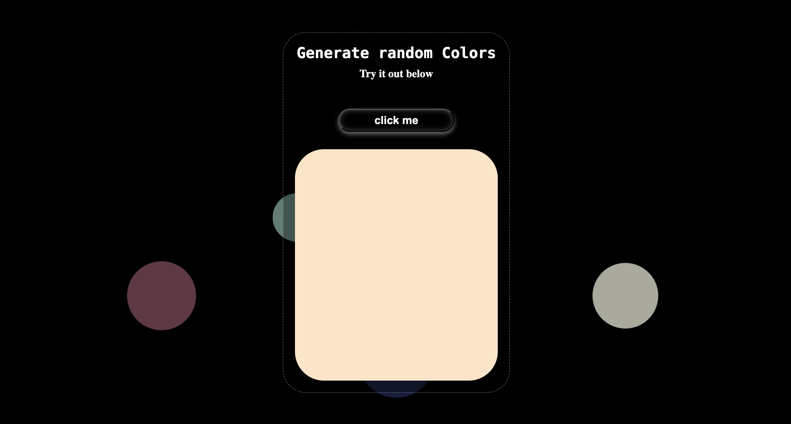

# Random Color Generator App

A simple interactive web application that changes the color of a box when a button is clicked.



## Overview

Color Generator is a lightweight web application that demonstrates basic DOM manipulation with JavaScript. It features a colored box and a button - when the button is clicked, the box changes to a random color.

## Features

- Clean, responsive user interface
- Random color generation
- One-click color changes
- Simple and lightweight code

## Installation

No installation is required. Simply download the project files and open `index.html` in any modern web browser.

```
git clone https://github.com/raakdgol/Random_Color_Generator
```

Or download the ZIP file and extract it to your preferred location.

## Usage

1. Open `index.html` in your web browser
2. Click the "Change Color" button to see the box change to a random color
3. Click again for a new random color

## Project Structure

```
GENERATE_RANDOM_COLOR/
│
├── index.html          # Main HTML file
├── styles.css      # CSS styling
├── script.js       # JavaScript functionality
├── images/             # Images folder
│   └── bg-circle.svg
    └── screenshot.png
└── README.md
```

## How It Works

The application uses JavaScript to:

1. Generate a random hexadecimal color code
2. Select the color box element in the DOM
3. Update the box's background color when the button is clicked

### Core Functionality

The main color changing functionality is powered by JavaScript

## Customization

You can easily customize this project by:

- Changing the default box color in the CSS
- Modifying the box dimensions
- Adding multiple color boxes
- Implementing different color generation algorithms
- Adding transitions or animations for color changes

## Browser Support

This application works in all modern browsers:

- Chrome 60+
- Firefox 55+
- Safari 10+
- Edge 15+

## Contributing

Contributions are welcome! Please feel free to submit a Pull Request.
